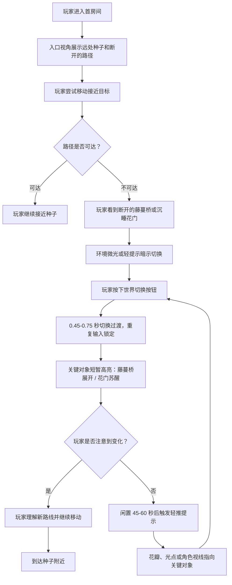
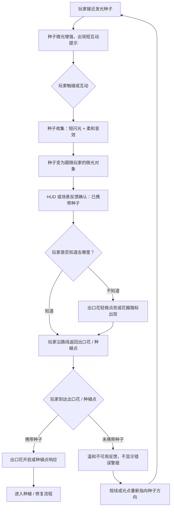
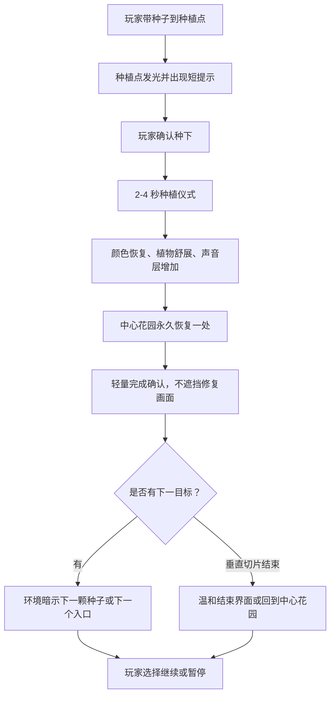

# UX Design Specification dual-world-time-puzzle

**Author:** Sue
**Date:** 2026-05-19

---

<!-- UX design content will be appended sequentially through collaborative workflow steps -->

## Executive Summary

### Project Vision

《微光花园 / Seedlight Garden》是一款低压力、俯视角、双世界花园解谜游戏。玩家控制迷路的小精灵，在“枯萎 / 盛放”两种花园状态之间切换，观察路径、藤蔓桥、花门、种子和出口花的变化，收集发光种子，并通过种下种子让中心花园逐步恢复生命、颜色和声音。

UX 设计的核心目标不是把机制解释得更复杂，而是让玩家在短时间内自然理解：切换世界会改变可通行路径和关键对象状态；收集并种下种子会让空间永久变好。游戏应支持安静、轻松、可逆的探索，让玩家获得“我看懂了这个小规律”和“我修复了这里”的双重回报。

### Target Players

核心玩家是 30-40 岁左右、偏休闲和 cozy 体验的成年玩家。他们可能不是硬核解谜玩家，也不一定熟悉复杂时间机制，但愿意在清晰、温柔、低压力的游戏里观察、尝试并完成小谜题。他们适合在通勤碎片时间、晚上放松或睡前短玩，每次完成一个房间也应获得完整闭环。

次级玩家是喜欢精致小体量独立解谜和 cozy indie 的玩家。他们重视机制优雅、画面可读、关卡节奏、音画反馈和情绪一致性。对这类玩家，游戏需要提供足够干净的谜题结构、可预测的双世界规则，以及令人记住的修复反馈。

### Key Design Challenges

- 双世界切换必须一眼可读，不能只是换色。关键对象需要同时通过形状、轮廓、动画、发光、声音或通行状态传达变化。
- 首房间要教会玩家核心规则，但不能变成文字教程。教学应主要由视线引导、对象状态变化、动画节奏和音频确认承担。
- 发光种子不能只是钥匙或收集品。UX 需要让它在“看见、接近、收集、跟随、种下、恢复”的全过程中保持情感对象感。
- 中心花园修复反馈必须足够明确。玩家种下第一颗种子后，应马上理解自己的行动永久改变了空间。
- UI 必须克制。它应该补充必要信息和可访问性选项，而不是替代表现反馈或把规则直接写在屏幕上。

### Design Opportunities

- 把“切换世界”做成玩家主动使用的修复工具，而不是硬核时间谜题。每次切换都可以成为看见隐藏规律的短暂惊喜。
- 用一房间一个小魔法的结构降低认知负担，让短时游玩也有完整的观察、理解、收集和恢复闭环。
- 让音画反馈承担提示、确认和奖励：藤蔓桥展开、花门苏醒、种子跟随、出口花打开和种下后的盛放都应成为 UX 重点。
- 用中心花园作为进度、情绪回报和章节选择空间，让玩家不用依赖数值进度条也能感到成长。
- 通过被动提示、闲置轻推和手动提示形成温和辅助层，帮助玩家继续推进，同时保留自主发现感。

## Core Player Experience

### Defining Experience

核心体验是让玩家在一个安静、短小的花园房间中，通过移动、切换“枯萎 / 盛放”世界、观察对象状态变化，找到通往发光种子的路线，并把种子带回种下，触发明确的修复反馈。

玩家最频繁做的动作是移动和观察，但最关键的交互是世界切换。切换必须让玩家立刻看懂“哪里变了、为什么重要、我下一步可以做什么”。如果世界切换可读、柔和且有魔法感，谜题理解、路线规划、种子收集和修复回报都会自然成立。

### Platform Strategy

首要平台是 PC / Steam，Web demo 用于试玩、传播和早期反馈。第一版以键盘和手柄为主要输入方式，移动、世界切换、互动、重置和暂停是核心输入。移动端暂不进入垂直切片承诺，只作为后续验证方向。

游戏应支持离线游玩。本地进度保存需要覆盖已种下种子、中心花园修复状态、已完成房间和设置。Web demo 应控制资源体积和加载时间，优先保证首个完整房间的流畅体验。

### Effortless Interactions

移动应轻松、稳定、低精度要求，玩家不应因为操作细节卡住。世界切换应是单按钮、可预测、有短暂输入锁，避免重复触发造成混乱。与种子、花门、出口花和种植点的互动应自动识别上下文，减少“站位必须很精确”的摩擦。

玩家不应反复确认是否可以走、是否已经收集、是否带着种子、是否完成房间。藤蔓桥展开、花门苏醒、种子跟随、出口花点亮和种下后的盛放，都应通过画面和声音自然确认状态。

### Critical Success Moments

第一个关键成功时刻是玩家第一次切换世界后，在 1 秒内注意到一个有意义的变化，例如藤蔓桥展开或花门状态改变。

第二个关键成功时刻是玩家第一次拿到发光种子，并看到种子以微光轨迹跟随自己，理解它不是普通钥匙，而是短暂陪伴自己的修复对象。

第三个关键成功时刻是玩家第一次种下种子后，看到中心花园产生永久、清晰、温暖的变化，并产生“我修复了这里”的感受。

任何一个关键链路失败都会伤害体验：世界切换看不懂、目标种子不明显、带回路线不清楚、种植反馈太弱，都会让游戏从 cozy puzzle 变成模糊试错。

### Experience Principles

1. 世界切换必须服务理解，而不是只服务装饰。
2. 每个房间优先保证一个清楚的小魔法，不堆叠复杂规则。
3. 关键状态必须通过颜色以外的维度表达，包括形状、轮廓、动画、发光、声音或通行变化。
4. 种子是情感对象，不是背包物品或普通钥匙。
5. UI 只补充必要信息，核心教学和确认优先交给场景、动画和音频。
6. 失败和卡住应可逆、低压力，玩家始终能重试、观察或获得温和提示。

## Desired Emotional Response

### Primary Emotional Goals

玩家游玩《微光花园 / Seedlight Garden》时，核心情绪应是安静的好奇、温柔的发现感和明确的修复回报。

玩家不应该感到被考验、被催促或被惩罚，而应该感到自己可以慢慢观察、尝试、理解，并把一个沉睡的小空间变得更好。完成一个房间后，理想感受是：“我看懂了这个小规律，我把这里修好了，我愿意再去找下一颗种子。”

### Emotional Journey Mapping

初次看到游戏时，玩家应感到柔和、可接近、有一点神秘感。进入房间后，情绪应从安静观察开始，而不是紧张求解。

第一次切换世界时，玩家应感到轻微惊喜和清晰理解：画面变化不只是漂亮，而是告诉玩家下一步可能怎么走。找到种子时，玩家应感到被吸引和想靠近。种子跟随玩家时，应产生短暂陪伴感。种下种子后，玩家应获得温暖、确认和小小成就感。

如果玩家卡住，目标情绪不是挫败，而是“我可以再看一眼、换个状态试试，或者获得一点温和提示”。再次回到游戏时，玩家应期待看到花园继续恢复，而不是担心忘记复杂规则。

### Micro-Emotions

关键微情绪包括：

- 信任感：玩家相信画面和声音提供的信息是可靠的。
- 轻度聪明感：玩家觉得自己发现了规律，而不是被系统直接告知答案。
- 安全感：错误尝试不会造成严厉后果。
- 陪伴感：发光种子像短暂同行的小对象，而不是普通道具。
- 修复感：种下种子后，空间产生清楚、永久、温暖的变化。
- 期待感：中心花园的变化暗示还有更多种子、区域和生命会被唤醒。

需要避免的情绪包括：看不懂关键对象的困惑、找不到目标的迷失、操作站位带来的烦躁、提示过强导致的被教训感、修复反馈太弱导致的空洞感。

### Design Implications

安静好奇感需要低噪声画面、清晰构图和入口处可读目标。房间开始时不应塞入大量 UI 或文字，而应让玩家看到种子、路径方向或关键对象。

温柔发现感需要让世界切换产生可比较的变化。切换后 1 秒内，当前谜题相关对象应通过动画、轮廓、发光、声音或通行变化被玩家注意到。

安全感需要可逆尝试、温和重置和无惩罚失败。玩家不应因为切换错误、走错路或没立刻理解规则而损失进度。

陪伴感需要强化种子的收集与跟随表现。种子被收集后应有短暂闪光、柔和音效和持续微光轨迹，让玩家意识到它正在跟着自己回家。

修复感需要种植仪式。种下种子后的 2-4 秒反馈应包括颜色恢复、植物舒展、声音层变丰富、中心花园永久变化，并尽量让玩家看见变化前后的差异。

### Emotional Design Principles

1. 玩家应先感到安全，再感到聪明。
2. 每个关键反馈都要回答玩家心里的问题：“我做对了吗？这里发生了什么？”
3. 种子相关反馈要比普通交互更温柔、更有陪伴感。
4. 修复反馈必须可见、可听、可记住。
5. 提示系统应像环境在轻轻指路，而不是 UI 在宣布答案。
6. 情绪节奏应从观察、惊喜、理解、陪伴走向恢复，而不是从困惑走向强行解答。

## UX Pattern Analysis & Inspiration

### Inspiring Products Analysis

**Monument Valley** 提供的主要启发是低压力、短关卡、清晰画面组织和视觉引导。它证明玩家可以通过观察画面理解规则，而不需要大量文字教学。《微光花园》可以借鉴它的“画面即说明书”思路，但不采用透视错觉作为核心机制，也不追求过度抽象的空间谜题。

**Unpacking** 的启发是空间修复带来的情绪回报。它让玩家通过整理空间感到“这里被我照顾好了”。《微光花园》应借鉴这种完成后的环境变化和情绪确认，但不采用物品整理、背包管理或现实生活叙事。

**Carto** 的启发是可爱、清晰、规则递进温和。它适合参考如何让非硬核玩家逐步理解空间规则。《微光花园》可以借鉴它的低门槛规则学习方式，但不引入地图拼接或大地图重排。

**Dorfromantik** 的启发是低惩罚、放松心流和世界逐步完整的满足感。《微光花园》可以借鉴“每一步都让世界更完整”的进度感，但不采用分数、优化压力或长局策略规划。

**Botanicula / Samorost** 的启发是植物、生物、微光、无字童话感和环境动画表达。《微光花园》可以借鉴它们用声音和小动画传达生命感，但要避免传统点触冒险式的热点试错。

### Transferable UX Patterns

- 画面引导优先于文字说明：入口视角应让玩家看见目标种子、关键路径或谜题对象。
- 低压力短闭环：每个标准房间都应提供观察、切换、理解、收集、种下、修复的完整小循环。
- 环境变化作为奖励：完成房间后的回报不只显示 UI 状态，而是让花园产生可见、可听、可回看的变化。
- 状态变化可比较：枯萎 / 盛放的差异应围绕当前谜题对象强化，避免全屏噪声变化淹没关键信息。
- 轻量收集成长：种子收集应驱动中心花园恢复，而不是发展成复杂背包、货币或升级系统。
- 无字叙事：通过植物苏醒、声音层增加、光点跟随和场景恢复表达情绪，不依赖大量对白。

### Anti-Patterns to Avoid

- 只靠颜色区分状态，导致色弱玩家或低注意力玩家看不懂关键变化。
- 把世界切换做成纯视觉滤镜，而不是影响路径、对象状态和玩家决策的核心工具。
- 用过多 UI 文案解释规则，削弱玩家自己发现规律的轻度聪明感。
- 房间目标隐藏过深，让玩家从观察谜题变成找像素点或盲目试错。
- 种子表现得像普通钥匙，收集后缺少陪伴感和情绪重量。
- 修复反馈过短、过弱或只显示数值，无法支撑“我让这里变好了”的核心承诺。
- 在早期引入复杂经济、背包、计分、倒计时或硬失败，破坏 cozy puzzle 的低压力定位。

### Design Inspiration Strategy

**采用：** 画面引导、短关卡闭环、低惩罚尝试、环境恢复奖励、音画反馈教学。这些模式直接支持项目的核心体验和目标玩家需求。

**改造：** 从参考游戏中借鉴“温和规则学习”和“空间变好”的体验，但将其改造成双世界花园解谜：玩家通过切换状态看懂路径变化，通过发光种子推动花园恢复。

**避免：** 避免透视错觉、地图拼接、物品整理、分数优化和点触热点试错等参考作品的具体机制。它们可以启发体验质量，但不应进入《微光花园》的核心系统。

**判断标准：** 任何借鉴都必须通过三个问题：它是否让世界切换更可读？是否让种子更有情感重量？是否让修复反馈更明确？如果答案是否定的，就不应加入垂直切片。

## Design System Foundation

### 1.1 Design System Choice

《微光花园 / Seedlight Garden》采用轻量定制游戏 UI 设计系统，而不是通用应用组件库。

设计系统范围聚焦于游戏内 HUD、暂停菜单、设置菜单、提示界面、互动提示、状态反馈、调试覆盖层和 Web demo 基础入口/结束界面。核心体验中的教学、确认和奖励仍优先由场景、动画和音频承担，UI 只负责补充必要信息。

### Rationale for Selection

项目是 Godot 4.6.2 2D 游戏，主要平台是 PC / Steam，Web demo 用于试玩传播。Material Design、Ant Design 或传统 Web UI 组件库不适合作为视觉基础，因为它们会让游戏界面偏工具化、应用化，削弱手绘花园、微光种子和温柔修复的情绪一致性。

轻量定制系统更适合单人开发和 AI 辅助生产：它能保持视觉独特性，同时避免完整品牌系统的高成本。系统只定义必要控件和规则，优先保证可读性、一致性、可访问性和实现效率。

### Implementation Approach

UI 使用 Godot 原生 `Control`、`CanvasLayer`、主题资源和可复用场景实现。每个 UI 元素都应有明确用途，不创建装饰性复杂面板。

首批组件包括：

- 互动提示：靠近种子、花门、出口花或种植点时出现。
- 世界切换反馈：轻量状态确认，不遮挡场景。
- 手动提示面板：用于温和提示，不直接显示答案。
- 暂停菜单：继续、重置房间、设置、退出。
- 设置菜单：音量、显示、可访问性、输入。
- 房间完成反馈：配合场景修复动画，只提供最少确认。
- 调试覆盖层：开发阶段显示世界状态、房间 ID、携带种子和恢复标记。

### Customization Strategy

视觉风格应与 2D 手绘花园一致：柔和、低噪声、清晰、不过度装饰。UI 不应抢过场景对象的注意力。

设计 tokens 应至少定义：

- 字体层级：菜单标题、正文、提示文本、调试文本。
- 颜色语义：普通文本、弱化文本、可互动、高亮、警示、不可用。
- 世界状态辅助色：枯萎与盛放可以有轻量 UI 辅助色，但不能作为唯一状态表达。
- 间距与尺寸：按钮、提示条、菜单行高、边距。
- 动效节奏：提示出现、消失、确认、禁用状态切换。
- 可访问性规则：对比度、颜色非唯一传达、文本可读尺寸、手柄焦点状态。

定制原则：

1. UI 看起来属于花园，而不是属于桌面应用。
2. HUD 默认最小化，只有在玩家需要时出现。
3. 每个 UI 控件必须服务行动、确认、设置或辅助，不做纯装饰。
4. 所有交互状态必须支持键盘和手柄焦点。
5. 提示文本要短、温和、具体，避免命令式教学口吻。
6. 调试 UI 与玩家 UI 分离，不能泄漏到发布体验。

## 2. Core Player Experience

### 2.1 Defining Experience

《微光花园 / Seedlight Garden》的定义性体验是：玩家一键切换“枯萎 / 盛放”世界，立刻读懂花园对象的变化，并利用这个变化找到发光种子、带回种下、修复空间。

玩家向朋友描述时，理想表达不是“这是一个复杂时间谜题”，而是“我切换花园状态，看见藤蔓和花门变化，然后把发光种子带回去让花园恢复”。这个体验如果成立，游戏的谜题、情绪回报、视觉 hook 和短时游玩闭环都会成立。

### 2.2 Player Mental Model

玩家会把“枯萎 / 盛放”理解为同一个花园的两种状态，而不是两个完全独立地图。因此 UX 应强化“同一空间发生变化”的连续感：位置关系保持稳定，关键对象在两种状态下有明确对应，变化发生在玩家能比较的位置。

玩家可能预期切换后会出现新路、打开对象、点亮目标或改变交互条件。他们容易困惑的地方包括：不知道哪里变了、不知道变化是否重要、不知道当前能否通行、不知道种子收集后应该去哪。所有核心反馈都要围绕这些疑问设计。

### 2.3 Success Criteria

核心交互成功的标准：

- 玩家第一次切换世界后，能在 1 秒内注意到至少一个与当前谜题相关的变化。
- 玩家能理解“切换状态会改变路径或对象状态”，而不是只把它当作视觉滤镜。
- 玩家能在不依赖长文字教程的情况下找到第一颗种子。
- 玩家收集种子后，知道它正在跟随自己，并能推断应带它去出口花或种植点。
- 玩家种下种子后，能明确感到空间被修复，而不是只看到通关提示。
- 错误尝试不会打断情绪，玩家能自然重试、观察或重置。

### 2.4 Novel UX Patterns

本项目结合了熟悉模式和轻度新模式。

熟悉模式包括：俯视角移动、靠近互动、房间目标、收集对象、返回出口、暂停和重置。这些应尽量沿用玩家已有理解，不增加多余复杂度。

轻度新模式是“双世界切换作为修复和观察工具”。它不是完全陌生的机制，但需要用首房间温和教学。教学方式应是：先让玩家看到不可达种子或断开的藤蔓桥，再通过一次切换看到通路变化，最后用种子修复花园完成闭环。

项目的独特 twist 是：切换不是为了制造硬核谜题压力，而是为了让沉睡花园显露另一种可能性。玩家不是操纵时间机器，而是在帮助花园重新记起如何盛放。

### 2.5 Experience Mechanics

**1. Initiation**

玩家进入房间时，应在入口附近看见目标方向：远处发光种子、断开的路径、沉睡花门或轻微发光的关键对象。房间不应先弹出长教程，而是用构图邀请玩家观察。

**2. Interaction**

玩家用移动键或手柄移动，用单按钮切换世界。切换触发 0.45-0.75 秒过渡，期间锁定重复切换输入。关键对象在过渡中或过渡后更新形态、通行、发光、动画和声音。

**3. Feedback**

切换成功后，当前谜题相关的 1-2 个对象应被短暂强调。藤蔓桥展开、花门苏醒、出口花点亮、种子增强微光等反馈应清楚告诉玩家“这里现在不同了”。如果玩家尝试不可用交互，反馈应温和而明确，例如轻轻摇动、低亮提示或短音效，而不是错误警报。

**4. Completion**

玩家到达种子后，收集触发短闪光和柔和音效，种子变成跟随玩家的微光对象。玩家带种子到出口花或种植点后，种下触发 2-4 秒修复仪式。完成后，房间或中心花园出现永久变化，并用环境恢复、声音层增加和轻量 UI 确认收尾。

**5. Next Step**

完成反馈结束后，场景应自然暗示下一颗种子、下一个入口或回到中心花园的方向。玩家不应被强行打断，而是被温和引向下一段短闭环。

## Visual Design Foundation

### Color System

视觉基础采用“安静枯萎 + 温柔盛放 + 微光种子”的三层色彩系统。颜色服务可读性和情绪，不只服务装饰。

**核心色彩方向：**

- 枯萎状态：低饱和灰绿、雾蓝灰、干叶紫灰，用于安静、沉睡、可恢复的空间。
- 盛放状态：鲜活叶绿、柔和花粉金、花瓣珊瑚、清亮天空蓝，用于生命恢复和路径打开。
- 微光种子：暖金白作为最高注意力色，只用于种子、种植点、关键奖励和极少量引导。

**建议语义色：**

- Primary / Seedlight：`#F7D66A`，用于种子、种植反馈、关键光点。
- Bloom Green：`#64B96A`，用于盛放状态、可通行植物、恢复区域。
- Petal Coral：`#E9867A`，用于温柔强调和花门苏醒。
- Clear Blue：`#78B7D6`，用于水面、可访问提示或轻量辅助。
- Withered Green Gray：`#7C8A77`，用于枯萎植物与低活跃对象。
- Deep Text：`#24302A`，用于深色文字或高对比 UI。
- Soft Panel：`#F4F1E8`，用于菜单底色，但避免大面积奶油色主导画面。

关键状态不能只靠颜色表达。藤蔓桥、花门、出口花、种子和种植点必须同时使用形状、轮廓、发光、动画、声音或通行状态表达差异。

### Typography System

文字系统应温和、清晰、不过度装饰。游戏内 UI 文本量应保持低密度，避免长段解释。

**建议字体策略：**

- 中文主字体：思源黑体 / Noto Sans SC，用于可读性和跨平台稳定。
- 英文主字体：Noto Sans / Inter，用于清晰菜单与调试文本。
- 标题可使用轻微圆润或手写感字体，但只用于少量标题和章节名，不能影响可读性。

**层级：**

- Menu Title：28-32 px
- Section Title：22-24 px
- Body / Menu Item：16-18 px
- Hint Text：15-16 px
- Debug Text：12-13 px

UI 文案应短、具体、温和。避免大段教程文字；优先让场景反馈承担说明。

### Spacing & Layout Foundation

布局采用 8px 基础间距。菜单和提示 UI 应留出足够呼吸感，但不能变成厚重卡片堆叠。

**布局原则：**

- HUD 默认最小化，避免遮挡房间、种子和关键对象。
- 互动提示靠近玩家或目标对象，但保持固定安全边距，避免覆盖角色。
- 暂停与设置菜单居中或侧栏展示，结构清楚，焦点路径适合手柄。
- 提示面板短小，优先一行或两行文本，不显示完整答案。
- 调试覆盖层独立于玩家 UI，使用单独视觉样式。

### Accessibility Considerations

- 关键状态不依赖颜色单独表达。
- UI 文本与背景保持足够对比度，Web demo 和 1080p PC 下均可读。
- 手柄焦点必须清楚，有高亮、描边或轻微动效。
- 所有提示应支持键盘和手柄操作。
- 闪光和粒子反馈应柔和，避免高频闪烁。
- 可提供基础设置：主音量、音乐、音效、显示模式、提示强度、减少闪烁。

## Design Direction Decision

### Design Directions Explored

已生成 HTML 设计方向展示页：

`_bmad-output/planning-artifacts/ux-design-directions.html`

展示页探索了 6 个方向：

1. 场景优先的极简 HUD：默认几乎没有 UI，通过场景构图、对象微光、切换涟漪和近身提示引导玩家。
2. 双状态对照 Lens：用枯萎 / 盛放并列对照强化“同一空间两种状态”的理解，适合教学和可读性测试。
3. 种子陪伴焦点：围绕发光种子强化收集、跟随、带回和种下的情感对象感。
4. 中心花园进度感：用环境恢复和轻量进度表达让玩家看见长期成长。
5. 柔和手册式菜单：用于暂停、设置和温和提示，强调手柄焦点和可读性。
6. 试玩与调试清晰优先：用于 Web demo 测试构建和开发调试，不作为默认玩家体验。

### Chosen Direction

主方向采用 `1 + 3 + 4` 的组合：

- 默认游玩采用“场景优先的极简 HUD”。
- 种子相关交互采用“种子陪伴焦点”。
- 中心花园、房间完成和长期回报采用“中心花园进度感”。

辅助方向：

- `2` 只用于首房间关键教学瞬间或可读性测试，不作为持续 UI 模式。
- `5` 用于暂停菜单、设置菜单和手动提示。
- `6` 只用于开发调试和 Web demo 测试构建。

### Design Rationale

这个组合最符合项目的核心体验和情绪目标。默认极简 HUD 让玩家注意力留在花园、藤蔓桥、花门和种子上，避免 UI 抢走场景反馈的职责。种子陪伴焦点能强化“发光种子不是钥匙，而是短暂同行的修复对象”。中心花园进度感能把收集结果转化为空间恢复，而不是数值或任务列表。

双状态对照 Lens 虽然有利于教学，但如果长期出现会让体验偏分析工具，削弱沉浸感。因此它应作为首房间的短暂辅助表达，或者作为开发阶段验证可读性的测试视图。调试清晰优先方向同样只进入测试构建，避免发布体验变得工具化。

### Implementation Approach

垂直切片的实现顺序：

1. 先实现无 HUD 或极简 HUD 的首房间流程，确保玩家能通过场景读懂目标。
2. 实现种子收集后的跟随表现、微光轨迹、柔和音效和出口花响应。
3. 实现种下种子后的 2-4 秒修复仪式，让中心花园出现永久变化。
4. 实现暂停、设置、重置和手动提示菜单，但默认不主动弹出。
5. 为测试构建保留调试覆盖层，显示世界状态、房间 ID、携带种子和恢复标记。

后续所有 UI 设计应优先问：它是否让场景更可读、让种子更有情感重量、让修复反馈更明确。如果不能满足其中至少一项，就不应进入默认体验。

## Player Journey Flows

### Journey 1: First Room World-Switch Understanding

玩家目标：进入第一个花园房间，理解切换“枯萎 / 盛放”会改变路径或对象状态。

关键 UX 要点：

- 首次切换后 1 秒内必须有明确变化。
- 强调 1-2 个当前谜题相关对象，不让全屏变化淹没重点。
- 如果玩家没看懂，提示应先指向“观察哪里”，不是直接给答案。

### Journey 2: Seed Collection and Companion Return

玩家目标：收集发光种子，理解它正在跟随自己，并把它带向出口花或种植点。

关键 UX 要点：

- 种子收集不是背包动作，应表现为短暂同行。
- 跟随微光轨迹持续告诉玩家“种子还在”。
- 出口花或种植点应在玩家携带种子后主动变得更可读。

### Journey 3: Planting and Center Garden Restoration

玩家目标：把种子种下，看到空间被永久修复，并理解下一步方向。

关键 UX 要点：

- 种植反馈必须让玩家看见变化前后差异。
- 完成确认应配合场景，不应变成大 UI 弹窗抢走修复瞬间。
- 中心花园应成为进度、情绪回报和下一步方向的载体。

### Journey Patterns

**Navigation Patterns**

- 入口展示目标方向：种子、出口花或关键对象应在进入房间早期可见或可被轻量暗示。
- 环境路标优先：花瓣、微光、植物姿态和声音方向优先于地图或任务列表。
- 中心花园作为自然 hub：完成后回到或看向中心花园，而不是只进入菜单。

**Decision Patterns**

- 单步决策：早期房间每次只要求玩家判断一个主要变化。
- 状态比较：玩家通过枯萎 / 盛放前后对比理解规则。
- 可逆尝试：切换、走错路和重置都不应造成严厉后果。

**Feedback Patterns**

- 关键变化短暂强调。
- 不可用交互温和反馈。
- 种子跟随持续确认。
- 修复结果永久保留并可回看。
- 提示先指向观察对象，再提示操作顺序。

### Flow Optimization Principles

1. 首次价值出现要快：玩家应在第一分钟内看到世界切换带来的有意义变化。
2. 每一步都回答玩家当前问题：目标在哪里、哪里变了、我是否做对、下一步去哪。
3. 减少 UI 解释，把重点放在场景反馈。
4. 卡住时先提供环境轻推，再提供手动提示。
5. 所有失败路径都要回到观察和尝试，而不是中断或惩罚。
6. 垂直切片优先验证三件事：看懂切换、愿意带回种子、感到修复回报。

## Component Strategy

### Design System Components

基础组件来自 Godot 原生 `Control`、`CanvasLayer`、主题资源和可复用场景，而不是外部应用组件库。

可作为基础组件的通用元素：

- Text Label：用于短提示、菜单项、设置说明和调试文本。
- Button / Focus Button：用于暂停菜单、设置菜单、确认和返回。
- Panel：用于暂停、设置、手动提示和结束界面。
- Toggle / Checkbox：用于辅助选项、减少闪烁、提示强度等二元设置。
- Slider：用于主音量、音乐、音效。
- Segmented Control：用于世界状态调试、显示模式或提示等级。
- Focus Container：用于手柄和键盘导航顺序。
- Debug Text Row：用于开发覆盖层。

这些基础组件必须使用项目视觉 tokens：8px 间距、柔和面板、清晰焦点、低装饰、高可读性。

### Custom Components

#### Interaction Prompt

**Purpose:** 在玩家靠近可交互对象时，提供最少量行动提示。  
**Usage:** 种子、花门、出口花、种植点、提示点。  
**Anatomy:** 输入图标或按键名 + 短动词 + 可选对象名。  
**States:** hidden、available、unavailable、pressed、disabled。  
**Variants:** 近身提示、屏幕边缘提示、手柄图标版本。  
**Accessibility:** 支持键盘和手柄提示文本；不能只显示图标。  
**Content Guidelines:** 文案短，例如“收集”“种下”“观察”“继续”。  
**Interaction Behavior:** 进入范围淡入，离开范围淡出；不可用时用温和摇动或低亮反馈。

#### World State Indicator

**Purpose:** 轻量确认当前处于“枯萎”或“盛放”，但不替代场景变化。  
**Usage:** 首房间教学、调试构建、玩家刚切换后的短暂确认。  
**Anatomy:** 状态名 + 小型状态符号 + 可选短动画。  
**States:** withered、bloom、switching、locked。  
**Variants:** 极简角落状态、首房间双状态对照、调试完整标签。  
**Accessibility:** 状态必须有文本或形状差异，不能只靠颜色。  
**Content Guidelines:** 默认不常驻大 HUD；只在需要确认时短暂出现。  
**Interaction Behavior:** 切换开始进入 switching，切换完成显示目标状态后淡出或缩小。

#### Seed Companion Indicator

**Purpose:** 告诉玩家种子已被收集并正在跟随，强化陪伴感。  
**Usage:** 收集种子后到种下之前。  
**Anatomy:** 跟随光点、微光轨迹、可选极简 HUD 标签。  
**States:** no_seed、collecting、following、ready_to_plant、planted。  
**Variants:** 场景内跟随为主；HUD 只在可读性不足时补充。  
**Accessibility:** 跟随状态应通过光点位置、轨迹、声音和必要文字共同确认。  
**Content Guidelines:** 避免背包化表达，不使用“物品栏 1/1”。  
**Interaction Behavior:** 收集时短闪光；跟随时保持柔和运动；靠近种植点时增强响应。

#### Gentle Hint Panel

**Purpose:** 在玩家主动请求或长时间卡住后提供温和提示。  
**Usage:** 手动提示、闲置提示升级、Web demo 引导。  
**Anatomy:** 一句观察方向 + 可选按键提示 + 关闭/继续。  
**States:** hidden、passive_nudge、manual_hint_level_1、manual_hint_level_2。  
**Variants:** 环境轻推、短文本提示、暂停菜单中的提示。  
**Accessibility:** 文本可读，支持键盘/手柄关闭。  
**Content Guidelines:** 先提示观察对象，再提示操作顺序；不直接写完整答案。  
**Interaction Behavior:** 闲置先触发环境提示，玩家主动请求才显示文本提示。

#### Pause and Settings Menu

**Purpose:** 提供继续、重置、设置、退出和提示入口。  
**Usage:** Esc / Menu 键打开。  
**Anatomy:** 标题、垂直菜单项、焦点状态、设置子页。  
**States:** closed、pause_root、settings、confirm_reset、confirm_exit。  
**Variants:** PC 键盘、手柄焦点、Web demo 版本。  
**Accessibility:** 明确焦点、循环导航、返回键一致。  
**Content Guidelines:** 不显示复杂任务列表；保持轻量。  
**Interaction Behavior:** 暂停时冻结 gameplay 输入；返回后恢复上一状态。

#### Restoration Completion Feedback

**Purpose:** 在种下种子后确认修复成功，同时不抢走场景修复瞬间。  
**Usage:** 房间完成、中心花园恢复、垂直切片结束。  
**Anatomy:** 场景恢复动画 + 极简文本确认 + 可选下一步提示。  
**States:** planting、restoring、completed、next_available。  
**Variants:** 首次种植完整仪式、后续房间短版反馈、demo 结束反馈。  
**Accessibility:** 反馈应可见可听；不依赖粒子或颜色单独表达。  
**Content Guidelines:** 文案短，例如“这里重新发光了”。  
**Interaction Behavior:** 2-4 秒修复仪式结束后，轻量提示下一步，不强制打断。

#### Debug Overlay

**Purpose:** 支持开发和 playtest 验证，不进入默认发布体验。  
**Usage:** 开发构建、Web demo 测试构建。  
**Anatomy:** FPS、world_state、is_switching、room_id、carried_seed_id、restoration_flags。  
**States:** hidden、compact、expanded。  
**Variants:** 文本覆盖层、调试面板。  
**Accessibility:** 不面向玩家，无需品牌化。  
**Interaction Behavior:** 通过开发热键切换，不影响玩家 UI。

### Component Implementation Strategy

组件实现应采用 Godot 可复用场景和脚本：

- `scenes/ui/interaction_prompt.tscn`
- `scenes/ui/world_state_indicator.tscn`
- `scenes/ui/gentle_hint_panel.tscn`
- `scenes/ui/pause_menu.tscn`
- `scenes/ui/settings_menu.tscn`
- `scenes/ui/restoration_feedback.tscn`
- `scenes/debug/debug_overlay.tscn`

组件应共享主题资源和设计 tokens，避免每个 UI 场景单独设置颜色、字体和间距。交互状态应通过明确的 enum 或 state 字段驱动，便于 AI 辅助实现时保持一致。

### Implementation Roadmap

**Phase 1 - Core Vertical Slice Components**

1. Interaction Prompt
2. World State Indicator
3. Seed Companion Indicator
4. Restoration Completion Feedback

**Phase 2 - Support and Recovery Components**

1. Pause and Settings Menu
2. Gentle Hint Panel
3. Reset confirmation
4. Basic accessibility settings

**Phase 3 - Testing and Polish Components**

1. Debug Overlay
2. Web demo start/end screen
3. Playtest feedback markers
4. Optional center garden progress display

## UX Consistency Patterns

### Button Hierarchy

**Primary Action**

用于当前界面最重要的行动，例如“继续”“种下”“确认重置”。一个界面最多一个 primary action。

视觉：柔和高亮边框或暖金强调，不使用强烈高饱和填充。  
行为：支持 Enter / A 键确认，焦点状态必须清楚。  
文案：短动词优先，例如“继续”“种下”“确认”。

**Secondary Action**

用于安全的替代行动，例如“设置”“返回”“稍后”。  
视觉：低对比面板或透明按钮，焦点时显示描边。  
行为：支持键盘、鼠标、手柄一致导航。

**Destructive / Risk Action**

用于“重置房间”“退出试玩”等可能中断当前流程的行动。  
视觉：不使用刺眼红色；用较深文字、确认面板和清楚说明表达风险。  
行为：必须二次确认，默认焦点不落在危险行动上。

### Feedback Patterns

**Success Feedback**

用于世界切换成功、种子收集、种下、房间完成。  
优先级：场景动画 > 声音 > 粒子/微光 > 极简 UI。  
规则：成功反馈应回答“我做对了吗”和“发生了什么”。

**Unavailable Feedback**

用于玩家试图与不可用对象互动。  
视觉：轻微摇动、低亮、花瓣闭合或短暂停顿。  
音频：柔和短音，不使用错误警报。  
规则：不可用反馈要说明“现在还不行”，不能让玩家觉得失败。

**Hint Feedback**

提示分三层：

1. Passive Cue：对象微光、花瓣路标、声音方向。
2. Idle Nudge：45-60 秒无进展后，关键对象短暂强调。
3. Manual Hint：玩家主动请求后显示短文本提示。

提示先指向观察对象，再提示操作顺序，不直接给完整答案。

**Completion Feedback**

完成反馈必须让玩家看到修复变化。UI 只能轻量确认，不遮挡修复动画。首次种植反馈应完整展示 2-4 秒，后续可缩短但不能消失。

### Form Patterns

游戏内表单仅用于设置，不设计复杂输入流程。

**Settings Rows**

用于音量、显示、提示强度、减少闪烁、语言等选项。  
结构：标签 + 当前值/控件 + 可选说明。  
焦点：整行可聚焦，左右调整 slider 或 segmented option。  
验证：设置即时生效，失败时恢复上一个有效值。

**Confirmation Dialogs**

用于重置房间、退出试玩、恢复默认设置。  
结构：一句说明 + primary 安全行动 + secondary 取消 + destructive 确认。  
默认焦点：取消或安全行动。  
文案：说明后果，例如“当前房间会回到入口，已种下的种子不会丢失。”

### Navigation Patterns

**Gameplay Navigation**

默认无地图和任务列表。玩家通过场景构图、光点、花瓣、声音和中心花园空间理解方向。

**Menu Navigation**

暂停菜单为垂直结构：继续、提示、重置房间、设置、退出。  
键盘：方向键 / WASD 移动焦点，Enter 确认，Esc 返回。  
手柄：D-pad / 左摇杆移动焦点，A 确认，B 返回。  
鼠标：hover 不应破坏当前手柄焦点状态。

**Post-Completion Navigation**

修复完成后，场景先展示变化，再出现轻量下一步提示。玩家应能选择继续探索、返回中心花园或暂停，而不是被立即传送。

### Additional Patterns

**Modal and Overlay Patterns**

暂停、设置、手动提示和确认对话可以使用 overlay。Overlay 必须暂停 gameplay 输入，保留清楚返回方式。不要把普通教学做成 modal。

**Loading States**

垂直切片应尽量避免房间内加载屏。必要加载使用简洁过渡：微光聚拢、短淡入淡出、状态文字不超过一行。

**Empty States**

中心花园未恢复区域不显示“空”。它应表现为沉睡、低亮、未盛放的空间，让玩家感到可恢复而不是缺内容。

**Debug Pattern**

调试覆盖层只在开发或测试构建出现。调试信息固定为结构化文本，不复用玩家 UI 风格，避免误入发布体验。

**Content Pattern**

所有 UI 文案遵循短、温和、具体原则。避免命令式、批评式、系统化口吻。例如使用“再观察那座藤蔓桥”而不是“错误：请切换状态”。

## Responsive Design & Accessibility

### Responsive Strategy

**Desktop / PC Steam**

PC 是主平台，默认以 16:9、1080p、键盘和手柄体验为基准。场景应优先完整展示房间结构、目标种子、关键对象和玩家位置。额外屏幕空间不应用来增加常驻 UI，而应用来提升场景可读性和环境呼吸感。

HUD 默认最小化。暂停、设置和提示面板可以居中或侧栏展示，但必须避免遮挡当前关键场景反馈。

**Web Demo**

Web demo 需要适应常见桌面浏览器窗口。最低目标应支持 1280x720 以上可玩，推荐 1920x1080 展示。浏览器窗口较小时，UI 文本和提示不能溢出，菜单应优先保持单列结构。

Web demo 不应因为浏览器尺寸变化暴露调试 UI 或破坏焦点顺序。首个房间必须在窗口化状态下仍能看清目标、关键对象和互动提示。

**Tablet / Mobile**

移动端不进入垂直切片承诺。后续若验证移动端，需要重新设计触控移动、世界切换按钮位置、提示密度、文字尺寸、可触达区域和横竖屏策略。

当前 UX 规格只要求：不要把核心交互设计成天然排斥未来触控。例如世界切换保持单按钮逻辑，互动范围不要过小，UI 不依赖 hover。

### Breakpoint Strategy

游戏内体验采用桌面优先，而不是移动优先。

建议测试尺寸：

- 1280x720：Web demo 最低桌面可玩目标。
- 1600x900：常见窗口化测试目标。
- 1920x1080：PC / Steam 主设计目标。
- 2560x1440：高分辨率验证，确保 UI 不显得过小或过散。
- 3840x2160：后续 4K 验证，需确认 UI scale。

UI 缩放应支持至少 100%、125%、150%。菜单、提示和焦点环应随 UI scale 放大，场景内关键对象的可读性也需要在 1080p 基准下验证。

### Accessibility Strategy

目标采用 WCAG AA 精神作为 UI 可读性标准，但结合游戏实际实现，不把 Web 表单标准机械套用到所有场景对象。

关键要求：

- 颜色不能作为唯一状态表达。枯萎 / 盛放、可通行 / 不可通行、可互动 / 不可互动必须同时使用形状、轮廓、动画、发光、声音或碰撞反馈。
- 普通 UI 文本应达到足够对比度，目标参考 4.5:1。
- 按钮和菜单项需要清楚焦点状态，键盘和手柄都可完整操作。
- 可交互目标在 gameplay 中不能要求像素级站位。
- 闪光、粒子和屏幕涟漪要柔和，避免高频闪烁。
- 需要基础音频设置：主音量、音乐、音效。
- 需要可访问性设置：减少闪烁、提示强度、可能的 UI 缩放。
- 不使用惩罚性失败、倒计时和强反应压力作为主线障碍。
- 手动提示应帮助玩家恢复方向，而不是羞辱或强制揭示答案。

### Testing Strategy

**Responsive Testing**

- 在 1280x720、1600x900、1920x1080、2560x1440 下测试完整首房间。
- 检查互动提示、暂停菜单、设置菜单和修复反馈是否遮挡关键对象。
- Web demo 在 Chrome、Edge、Firefox 中测试窗口化和全屏。
- 验证 UI scale 100%、125%、150%。

**Input Testing**

- 键盘完整通关首房间。
- 手柄完整通关首房间。
- 鼠标、键盘、手柄混用后焦点状态不丢失。
- 暂停菜单、确认对话和设置项支持返回与取消。

**Accessibility Testing**

- 色弱模拟检查枯萎 / 盛放、藤蔓桥、花门、种子、出口花是否仍可区分。
- 关闭音乐或降低音效后，关键反馈仍能通过视觉理解。
- 减少闪烁开启后，世界切换和种植反馈仍清楚。
- 让至少 5 名目标玩家试玩，记录他们是否看懂切换、是否知道种子跟随、是否感到修复回报。

### Implementation Guidelines

- 所有 UI 使用可缩放主题资源，避免硬编码散落的字体和颜色。
- 所有玩家可操作菜单项必须有明确 focus state。
- Interaction Prompt 必须有文本版本，不能只靠图标。
- 世界切换反馈必须同时更新视觉、声音和对象状态。
- 关键动画时长应可调，减少闪烁模式可以降低粒子强度和屏幕波纹。
- 菜单和提示面板应使用固定安全边距，避免贴边或遮挡玩家。
- Debug Overlay 与玩家 UI 分离，发布构建默认隐藏。
- 每次新增 UI 组件都要检查：键盘可达、手柄可达、文本不溢出、颜色非唯一表达。
